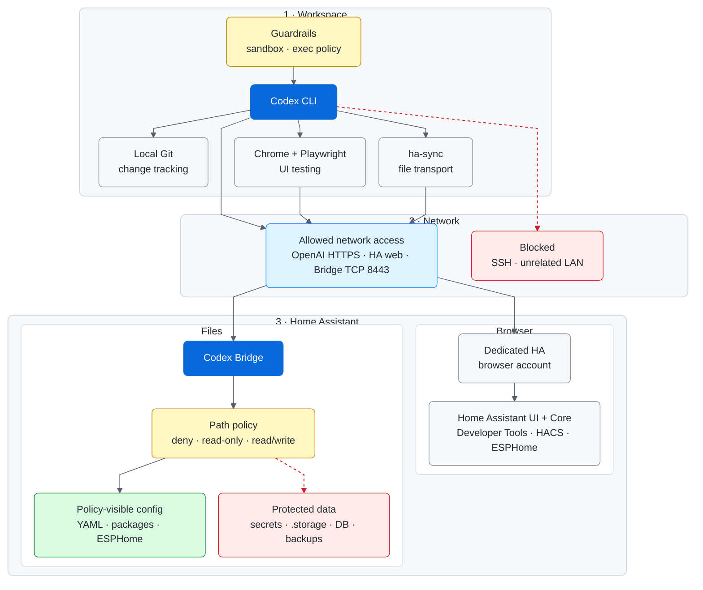

# Home Assistant Codex Bridge

[](https://www.home-assistant.io/)
[](https://developers.openai.com/codex/)
[](LICENSE)
[](docs/SECURITY.md)

**Safely give Codex the tools to build and maintain Home Assistant — without giving it your secrets or your host.**

A least-privilege reference architecture for letting OpenAI Codex build, test, and maintain a Home Assistant installation from an isolated Ubuntu desktop VM without giving Codex Home Assistant secret values, `.storage`, HAOS SSH/root access, databases, or backups.

The project combines:

- a restricted HTTPS file bridge running as a local Home Assistant app;
- an allow/read-only/deny filesystem policy enforced on the Home Assistant side;
- the `ha-sync` client for controlled file synchronization;
- a dedicated Home Assistant browser account;
- visible Chrome + Playwright MCP for functional and visual testing;
- Codex sandbox/exec-policy examples;
- task-scoped authorization rules for normal iterative work and named ESPHome devices;
- local Git change tracking.

> **Public-template note:** this repository intentionally contains no live deployment IP addresses, Home Assistant user IDs, secret aliases, tokens, browser data, or private hostnames. Replace documented placeholders only in your local deployment.

## Start here

- **Install from scratch:** [`docs/FIRST_TIME_SETUP.md`](docs/FIRST_TIME_SETUP.md)
- **Runtime/Ubuntu workflow:** [`docs/UBUNTU_RUNTIME.md`](docs/UBUNTU_RUNTIME.md)
- **Prompting Codex/ChatGPT:** [`docs/PROMPTING.md`](docs/PROMPTING.md)
- **Runtime contract template:** [`CODEX_REFERENCE.md`](CODEX_REFERENCE.md)
- **Security architecture:** [`docs/SECURITY.md`](docs/SECURITY.md)
- **Bridge API:** [`docs/API.md`](docs/API.md)
- **Troubleshooting:** [`docs/TROUBLESHOOTING.md`](docs/TROUBLESHOOTING.md)
- **Reference status:** [`docs/STATUS.md`](docs/STATUS.md)
- **Public-release checklist:** [`docs/PUBLIC_RELEASE_CHECKLIST.md`](docs/PUBLIC_RELEASE_CHECKLIST.md)

## Architecture



The design deliberately has two independent Home Assistant access paths. `ha-sync` moves files between the local Git working tree and the HTTPS bridge, where Home Assistant-side policy decides what is readable, writable, or denied. Chrome + Playwright reaches the Home Assistant UI through a separate browser privilege boundary; filesystem policy does not make that UI account low privilege.

Local Git is part of the VM work loop for diffs and known-good commits, not a bypass around the bridge. The bridge token authenticates `ha-sync` but does not bypass the path policy. The VM should be denied general lateral LAN access, and bridge TCP 8443 should never be exposed to the public Internet.

## What Codex can do

Within an authorized task and the configured policy, the design supports:

- advanced Lovelace/dashboard creation and visual refinement;
- Home Assistant YAML/package work;
- automations, scripts, scenes, themes, helpers and templates;
- REST/API-backed entities using existing `!secret` aliases without reading values;
- state/history/log inspection;
- already-installed HACS frontend cards;
- ESPHome YAML editing, validation and compilation;
- repeated OTA/re-flash cycles for an explicitly authorized named ESPHome device;
- visible browser testing through Playwright;
- local Git diffs and commits.

Typical authorized workflow:

```text
inspect -> edit -> validate -> deploy/reload -> test -> visually inspect
       -> refine -> repeat -> commit known-good work
```

## What Codex does not get

The reference design keeps these outside normal Codex filesystem access:

- Home Assistant and ESPHome `secrets.yaml` values;
- Home Assistant `.storage`;
- HAOS root/SSH/Supervisor shell access;
- databases and backups;
- OpenAI/Codex authentication material;
- direct shell access to the Playwright browser profile/cookies;
- unrelated LAN hosts through the network boundary.

The dedicated Home Assistant browser account can be more powerful than the file bridge. Treat browser/UI access as a separate privilege boundary and retain explicit approval rules for high-impact operations.

## Configuration placeholders

Documentation uses these placeholders:

```text
<HA_HOST>             Home Assistant hostname or LAN IP
<HA_URL>              Full Home Assistant URL, e.g. https://<HA_HOST>
<CODEX_VM_IP>         Fixed/reserved Ubuntu VM address
<CODEX_HA_USER_ID>    Dedicated Home Assistant user's internal ID
<REPOSITORY_URL>      URL of your fork/copy of this repository
```

Where concrete example addresses are useful, documentation uses RFC 5737 TEST-NET addresses such as `192.0.2.10` and `192.0.2.20`. They are examples only and must not be copied as real LAN addresses.

## Repository layout

```text
addon/                         Home Assistant local app
  config.yaml
  Dockerfile
  run.sh
  server.py

policy/                        HA-side authorization policy
  READ_WRITE.txt
  READ_ONLY.txt
  DENY.txt

client/                        Ubuntu-side helpers
  ha-sync
  install-playwright-service.sh
  install-codex-desktop-shortcut.sh

codex/                         Codex templates
  AGENTS.md
  config.example.toml
  homeassistant.rules

docs/
  FIRST_TIME_SETUP.md
  UBUNTU_RUNTIME.md
  PROMPTING.md
  SECURITY.md
  API.md
  SETUP.md
  STATUS.md
  TROUBLESHOOTING.md
  PUBLIC_RELEASE_CHECKLIST.md

CODEX_REFERENCE.md
LICENSE
NOTICE
CONTRIBUTING.md
SECURITY.md
```

## Secret hygiene

Never commit or paste into prompts:

- bridge bearer tokens;
- Home Assistant/ESPHome secret values;
- Home Assistant passwords/access tokens;
- trusted-user IDs;
- OpenAI API keys/auth files;
- GitHub tokens;
- TLS private keys;
- browser profiles/cookies;
- SSH keys;
- databases or backups.

A locally generated `SECRET_NAMES.md` may contain alias **names only**. It is intentionally ignored by the repository.

## License

Home Assistant Codex Bridge is licensed under the **Apache License 2.0 subject to the Commons Clause License Condition v1.0**. See [`LICENSE`](LICENSE) and [`NOTICE`](NOTICE).

In practical terms, the license permits use, modification and redistribution, including internal business use, but the Commons Clause restricts selling the software or providing a paid product/service whose value derives entirely or substantially from its functionality.

Because the Commons Clause adds a commercial-use restriction, this is a **source-available** license rather than an OSI-approved open-source license.

## Disclaimer

This is a practical hobby/home-automation least-privilege architecture, not a formal high-assurance security product. Review the policy, network isolation and Home Assistant account privileges for your own environment before use.
